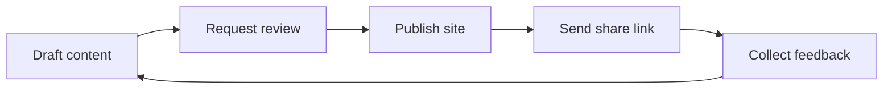

# Nimbus Docs

Use this space to test how GitBook handles structured docs, reviews, publishing, permissions, AI search, and MCP-ready content.


This is a Nimbus-branded test environment owned by <code class="expression">space.vars.owner</code>. Treat it as a sandbox for trying workflows before applying them to customer-facing or internal production docs.


## Brand system

| Element | Applied style |
| --- | --- |
| Primary color | Nimbus blue `#2563EB` |
| Secondary color | Signal cyan `#22D3EE` |
| Accent color | Launch amber `#F59E0B` |
| Base tone | Ink `#111827` |
| Surfaces | Cloud `#F8FAFC` and soft sky `#E0F2FE` |
| Logo treatment | Nimbus wordmark and icon, scaled uniformly and kept high contrast |

<table data-view="cards"><thead><tr><th></th><th></th><th></th><th data-hidden data-card-target data-type="content-ref"></th></tr></thead><tbody>
<tr>
  <td><h3><i class="fa-rocket" style="color:$primary;">:rocket:</i></h3></td>
  <td><strong>Quickstart</strong></td>
  <td>Make a small edit, request review, and publish safely.</td>
  <td><a href="start-here/quickstart.md">quickstart</a></td>
</tr>
<tr>
  <td><h3><i class="fa-sitemap" style="color:$primary;">:sitemap:</i></h3></td>
  <td><strong>Site map</strong></td>
  <td>Understand how this test site is organized.</td>
  <td><a href="start-here/site-map.md">site-map</a></td>
</tr>
<tr>
  <td><h3><i class="fa-users" style="color:$primary;">:busts_in_silhouette:</i></h3></td>
  <td><strong>Invite your team</strong></td>
  <td>Add teammates to a workspace and confirm the right access level.</td>
  <td><a href="publishing/invite-your-team.md">invite-your-team</a></td>
</tr>
<tr>
  <td><h3><i class="fa-wand-magic-sparkles" style="color:$primary;">:sparkles:</i></h3></td>
  <td><strong>AI search</strong></td>
  <td>Shape pages so visitors get crisp answers from Search and Ask.</td>
  <td><a href="configuration/ai-search-and-mcp.md">ai-search-and-mcp</a></td>
</tr>
</tbody></table>

## Recommended test flow

## What to validate

| Area | What good looks like |
| --- | --- |
| Navigation | Readers can find the right page in two clicks. |
| Review | Draft changes are clear and easy to approve. |
| Publishing | Share links work without exposing the wrong content. |
| Search | Important concepts are written in language people would search for. |
| MCP readiness | Pages have clear headings, stable terminology, and concise answers. |

