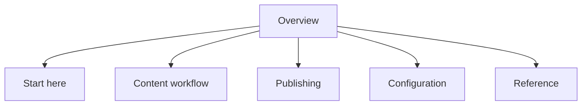

# Site map

The space is organized around the workflows a docs owner will test most often.

## Page groups

| Group | Purpose |
| --- | --- |
| Start here | First-run navigation and quick validation. |
| Content workflow | Standards, review flow, and quality expectations. |
| Publishing | Share links, workspace access, and team invitations. |
| Configuration | Branding, navigation, AI search, and MCP readiness. |
| Reference | Checklist and FAQ content for repeat tests. |

